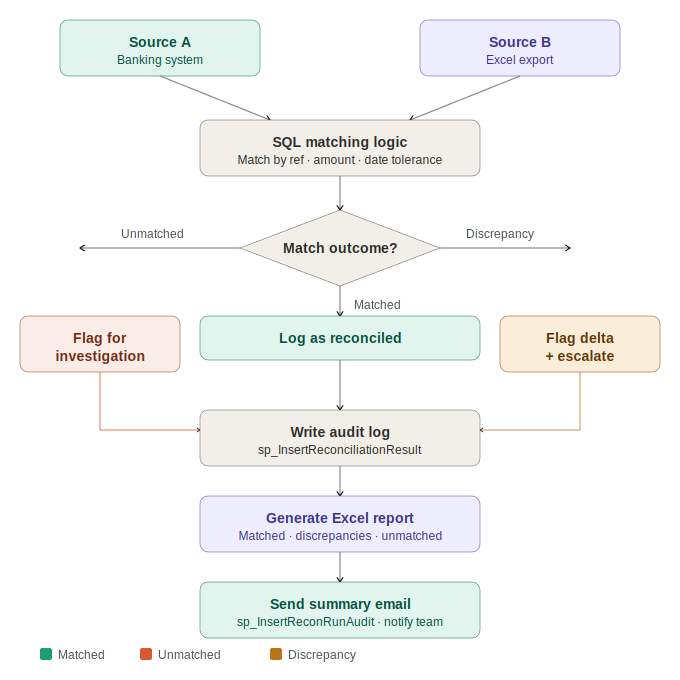

# 🏦 Bank Reconciliation Bot
### Blue Prism · SQL Server · VBO Components · Excel Automation · Control Room


---

## Overview

A Blue Prism automation that performs end-to-end bank reconciliation — pulling transaction data from two sources, comparing records using **SQL-driven matching logic**, identifying discrepancies, and generating a formatted reconciliation report. Designed to replace a fully manual, analyst-driven process that previously took hours each day.

Scheduled nightly via **Blue Prism Control Room** with automatic email notification on completion and escalation on unresolved discrepancies.

---

## Business Problem

| Pain Point | Impact |
|---|---|
| 2–4 hours of daily analyst time | High operational cost, analyst burnout |
| Manual comparison error rate | Missed discrepancies, financial risk |
| No consistent audit trail | Compliance and governance gaps |
| Delayed reporting | Finance team working with stale data |
| Inconsistent escalation | Different analysts handle exceptions differently |

---

## Solution Results

| Metric | Result |
|---|---|
| Reconciliation time | Minutes vs. hours manually |
| Efficiency improvement | 3× faster than manual process |
| Audit coverage | 100% — every transaction logged |
| Consistency | Identical logic applied to every record, every run |
| Scheduled execution | Nightly via Control Room — zero manual trigger |

---

## Architecture


```
┌──────────────────────────────────────────────────────────────┐
│                     Blue Prism Process                        │
│                                                              │
│  ┌─────────────┐    ┌──────────────┐    ┌────────────────┐  │
│  │  Data Pull  │───▶│  SQL Match   │───▶│  Report Gen    │  │
│  │             │    │  & Compare   │    │                │  │
│  │ • Banking   │    │ • Exact match│    │ • Matched ✅   │  │
│  │   system    │    │ • Fuzzy      │    │ • Discrepancy ⚠│  │
│  │ • Excel     │    │   tolerance  │    │ • Unmatched ❌  │  │
│  │   export    │    │ • Flag delta │    │ • Summary stats│  │
│  └─────────────┘    └──────────────┘    └────────────────┘  │
│                                                    │          │
│                                          ┌─────────▼──────┐  │
│                                          │ Audit + Alert  │  │
│                                          │ • SQL log      │  │
│                                          │ • Email report │  │
│                                          └────────────────┘  │
└──────────────────────────────────────────────────────────────┘
```

---

## Key Components

| Component | Type | Purpose |
|---|---|---|
| `Reconciliation_Main` | Blue Prism Process | Main orchestration process |
| `VBO_DataExtraction` | Visual Business Object | Pull data from banking system and Excel |
| `VBO_SQLOperations` | Visual Business Object | All database queries and stored procedures |
| `VBO_Matching` | Visual Business Object | Comparison logic and discrepancy detection |
| `VBO_ReportBuilder` | Visual Business Object | Format and write Excel reconciliation report |
| `VBO_EmailNotification` | Visual Business Object | Send completion and escalation emails |
| `VBO_AuditLogger` | Visual Business Object | Write audit records to SQL on every run |

### Why Reusable VBOs?
Each VBO is independently testable and reusable across other Blue Prism processes. This reduces development time, simplifies maintenance, and ensures consistent behaviour across the automation estate.

---

## Reconciliation Logic

### Matching Rules
1. **Primary match** — Transaction ID exact match across both sources
2. **Amount validation** — Amounts must match within configured tolerance (default: ±$0.01)
3. **Date validation** — Transaction dates must match within configured window (default: same business day)
4. **Reference validation** — Payment reference codes compared where available

### Outcome Classification
| Status | Description | Action |
|---|---|---|
| ✅ Matched | All fields reconcile within tolerance | Log as reconciled, no action needed |
| ⚠️ Discrepancy | Transaction found in both sources but values differ | Flag in report, escalate if above threshold |
| ❌ Unmatched — Source A | Transaction in banking system, missing from Excel | Flag for investigation |
| ❌ Unmatched — Source B | Transaction in Excel, missing from banking system | Flag for investigation |

---

## SQL Operations

### Stored Procedures Used
| Procedure | Purpose |
|---|---|
| `sp_GetBankTransactions` | Retrieve transactions from banking system table for date range |
| `sp_GetExcelTransactions` | Retrieve imported Excel transactions for date range |
| `sp_InsertReconciliationResult` | Write matched/unmatched outcome per transaction |
| `sp_InsertRunAudit` | Write run-level summary (total processed, matched, discrepancies) |
| `sp_GetUnresolvedDiscrepancies` | Pull unresolved items for escalation email |

### Audit Tables
| Table | Purpose |
|---|---|
| `dbo.RPA_Recon_Results` | Per-transaction reconciliation outcome |
| `dbo.RPA_Recon_AuditLog` | Run-level summary — date, volume, match rate, runtime |
| `dbo.RPA_Recon_Exceptions` | Unresolved discrepancies with full context |

---

## Output Report Structure

The Excel reconciliation report generated on each run contains:

| Sheet | Contents |
|---|---|
| `Summary` | Run date, total records, matched count, discrepancy count, match rate % |
| `Matched` | All successfully reconciled transactions |
| `Discrepancies` | Flagged items with source values, expected values, and delta |
| `Unmatched_BankOnly` | Transactions in banking system not found in Excel |
| `Unmatched_ExcelOnly` | Transactions in Excel not found in banking system |

---

## Exception Handling

| Exception | Trigger | Action |
|---|---|---|
| Source data unavailable | Banking system or file share inaccessible | Retry 3× then abort, alert IT |
| SQL connection failure | Database timeout or unavailable | Retry with backoff, then abort |
| Zero records returned | Empty dataset from either source | Alert — possible data pipeline issue |
| Report write failure | Output file locked or path inaccessible | Retry, then send report via email as fallback |
| Discrepancy threshold exceeded | Discrepancy rate above configured % | Automatic escalation to finance manager |

---

## Tech Stack

- **Blue Prism** — Process and VBO development
- **Blue Prism Control Room** — Scheduling, monitoring, and resource allocation
- **SQL Server** — Matching logic, stored procedures, audit logging
- **Microsoft Excel** — Source data import and output report generation
- **SMTP** — Completion and escalation email notifications

---

## Configuration

| Config Item | Description |
|---|---|
| `AmountTolerance` | Max allowed amount variance before flagging discrepancy |
| `DateWindowDays` | Max date difference for transaction matching |
| `DiscrepancyEscalationThreshold` | % discrepancy rate that triggers escalation email |
| `ReportOutputPath` | Network path for output Excel report |
| `ScheduledRunTime` | Nightly run time configured in Control Room |
| `AlertEmailRecipients` | Finance manager and AP lead distribution list |

---

## Author

**Blessing Nnabugwu** — RPA Developer  
[LinkedIn](https://linkedin.com/in/blessingnnabugwu) · [Portfolio](https://zinniie.github.io) · [GitHub](https://github.com/zinniie)
 
