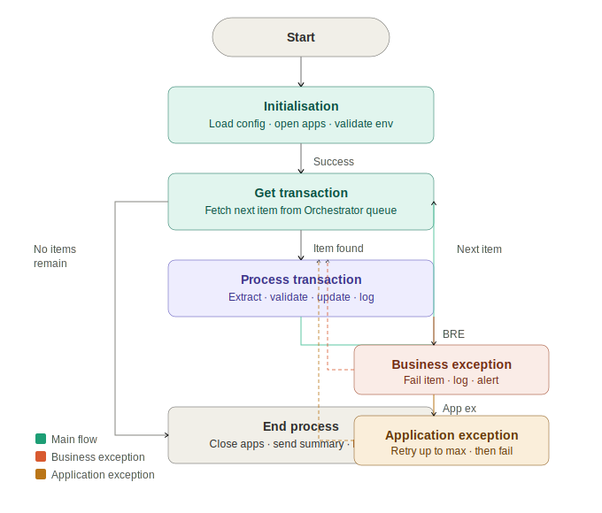

# ⚙️ REFramework Transaction Processor
### UiPath · Orchestrator Queues · Exception Handling · Config Management · Logging


---

## Overview

A clean, fully documented implementation of the **UiPath Robotic Enterprise Framework (REFramework)** — the industry-standard architecture pattern for scalable, resilient transactional automation.

This project demonstrates **best-practice UiPath development** including structured exception handling, Orchestrator queue management, config-driven design, and comprehensive logging. It is designed to serve both as a **production-ready bot** and as a **reference implementation** for teams adopting REFramework.



---

## What is REFramework?

REFramework is a UiPath template that implements a **state machine** to process a list of transactions reliably. It separates concerns cleanly:

```
┌─────────────────────────────────────────────────────────────────┐
│                    REFramework State Machine                     │
│                                                                  │
│   ┌──────────────┐                                              │
│   │Initialisation│ ──────── Load config, open apps,            │
│   │    State     │          validate environment                │
│   └──────┬───────┘                                              │
│          │  Success                                              │
│          ▼                                                       │
│   ┌──────────────┐          No more items                       │
│   │Get Transaction│ ─────────────────────────────▶ End Process │
│   │    State     │                                              │
│   └──────┬───────┘                                              │
│          │  Item retrieved                                       │
│          ▼                                                       │
│   ┌──────────────┐  Business    ┌─────────────────┐            │
│   │   Process    │  Exception ──▶ Mark Failed      │            │
│   │ Transaction  │              │ Log + Alert      │            │
│   │    State     │  App         └────────┬────────┘            │
│   └──────┬───────┘  Exception            │                      │
│          │                     ┌─────────▼────────┐            │
│          │          Retry? ────▶ Retry Transaction │            │
│          │                     └──────────────────┘            │
│          │  Success                                              │
│          └──────────────────────────────▶ Get Transaction       │
└─────────────────────────────────────────────────────────────────┘
```

---

## Project Structure

```
REFramework-Transaction-Processor/
│
├── Main.xaml                          # State machine entry point
│
├── Framework/
│   ├── InitAllSettings.xaml           # Load config from Excel + Orchestrator Assets
│   ├── InitAllApplications.xaml       # Open and validate all applications
│   ├── GetTransactionData.xaml        # Fetch next queue item from Orchestrator
│   ├── Process.xaml                   # Core business logic (plug your process here)
│   ├── SetTransactionStatus.xaml      # Mark queue item Success / Failed / Rejected
│   ├── CloseAllApplications.xaml      # Graceful application shutdown
│   └── TakeScreenshot.xaml            # Capture evidence on exception
│
├── Data/
│   └── Config.xlsx                    # All environment and process configuration
│
├── Tests/
│   ├── InitAllApplications_Test.xaml  # Unit test — initialisation
│   ├── GetTransactionData_Test.xaml   # Unit test — queue retrieval
│   └── Process_Test.xaml             # Unit test — business logic
│
└── docs/
    └── SDD-RPA-001.docx              # Solution Design Document
```

---

## Exception Handling — The Full Picture

This is the most important part of any REFramework implementation. This project implements the complete pattern:

### Business Exceptions
> Data is valid enough to process but fails business rules. **No retry.**

```vb
' Throwing a business exception in UiPath
Throw New BusinessRuleException("PO Not Found: " & invoiceNumber)
```

- Queue item marked as **Failed** with descriptive reason
- Exception detail written to `dbo.RPA_ExceptionLog`
- Alert email sent to process owner
- Bot immediately moves to next queue item

### Application Exceptions
> System or environment failure — not a data problem. **Retry up to max.**

```vb
' Caught automatically by REFramework
' Configured retry in Config.xlsx: MaxRetryNumber = 3
```

- Queue item **retried** up to `MaxRetryNumber` (from config)
- Each retry attempt logged with attempt number and error
- If retries exhausted → item marked Failed, screenshot captured, alert sent
- Bot continues to next item — **one bad item never kills the run**

### Initialisation Exceptions
> Environment not ready at startup.

- Bot retries initialisation up to 3 times
- If still failing → entire run aborted, IT team alerted
- No queue items consumed until environment is confirmed healthy

---

## Configuration Design

All configuration lives in two places — never hardcoded in workflows:

### Config.xlsx (non-sensitive settings)
| Setting | Default | Description |
|---|---|---|
| `MaxRetryNumber` | 3 | Max retries on application exceptions |
| `MaxConsecutiveSystemExceptions` | 3 | Abort threshold for consecutive system failures |
| `OrchestratorQueueName` | `TransactionQueue` | Target queue name |
| `LogF_BusinessProcessName` | `TransactionProcessor` | Process name for Orchestrator logs |
| `EmailAlertRecipient` | (email) | Alert destination on exceptions |
| `ScreenshotOnException` | True | Capture screenshot on app exception |

### Orchestrator Assets (sensitive settings)
| Asset | Type | Description |
|---|---|---|
| `DB_ConnectionString` | Credential | Database connection |
| `AppUsername` | Credential | Application login |
| `AppPassword` | Credential | Application password |
| `SMTPServer` | Text | Email server address |

---

## Logging Strategy

Every action is logged at the right level — giving full visibility in Orchestrator without noise:

```
[INFO]  Process started — Queue: TransactionQueue
[INFO]  Initialisation complete — 3 applications opened
[INFO]  Transaction retrieved — ID: TXN-00247, Attempt: 1
[INFO]  Extraction complete — Invoice: INV-2024-0891
[INFO]  Validation passed — PO match confirmed
[INFO]  Database updated — Payment record inserted
[INFO]  Transaction successful — ID: TXN-00247 [0.8s]
[WARN]  Business exception — TXN-00251: Amount mismatch ($4,210 vs $4,150)
[ERROR] Application exception — TXN-00253: SQL timeout (Attempt 2/3)
[INFO]  Transaction successful — TXN-00253 on retry 3
[INFO]  Run complete — 47 processed, 45 successful, 2 failed [38.4s]
```

---

## Orchestrator Queue Management

Queue items carry structured data and return structured status:

### Queue Item Input Fields
| Field | Type | Description |
|---|---|---|
| `TransactionID` | String | Unique identifier for this transaction |
| `FilePath` | String | Path to source document |
| `Priority` | Integer | Processing priority (1=High, 2=Normal, 3=Low) |
| `DueDate` | DateTime | Latest acceptable processing time |

### Queue Item Output Status
| Status | When Set | Includes |
|---|---|---|
| `Successful` | Business logic completed without error | Processing time, output reference |
| `Failed` | Business or app exception after max retries | Exception type, message, stack trace |

---

## How to Adapt This for Your Process

1. Clone the repo
2. Open `Process.xaml` — replace the sample logic with your automation steps
3. Update `Config.xlsx` with your environment settings
4. Create your Orchestrator queue and Assets
5. Run `InitAllApplications_Test.xaml` to validate your environment setup
6. Deploy to Orchestrator and schedule

> The framework handles everything else — exception handling, retry logic, logging, and reporting are all wired up.

---

## Tech Stack

- **UiPath Studio** — Workflow development
- **UiPath Orchestrator** — Queue management, asset storage, scheduling, monitoring
- **VB.NET** — Custom expressions, data manipulation
- **SQL Server** — Audit logging (optional — configurable)
- **SMTP** — Exception and run summary alerts

---

## Author

**Blessing Nnabugwu** — RPA Developer  
[LinkedIn](https://linkedin.com/in/blessingnnabugwu) · [Portfolio](https://zinniie.github.io) · [GitHub](https://github.com/zinniie)
