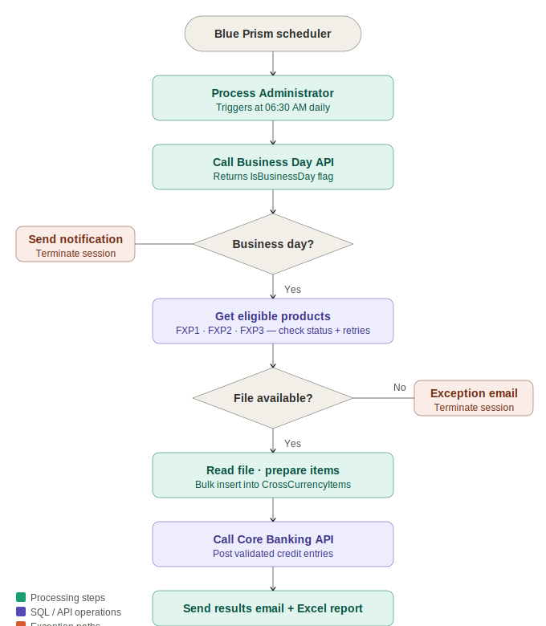

# 💱 Cross Currency Posting Automation
### Blue Prism · Business Day API · Core Banking API · SQL Server · Scheduled Automation


---

## Overview

A Blue Prism automation that manages the full end-to-end Cross Currency Posting process across three scheduled daily sessions. The bot retrieves foreign exchange posting files from a shared network folder, validates transactions against business day rules via an internal API, posts credit entries to the core banking system, and distributes formatted results to stakeholders, with zero manual intervention on clean runs.

Built using a **master-orchestrator pattern** where a central Process Administrator routes each session to a dedicated Business Object via product code, enabling independent session processing and granular failure isolation.

---

## Business Problem

| Pain Point | Impact |
|---|---|
| Manual file retrieval and data entry across 3 daily sessions | High staff time, error-prone on peak days |
| No automated business day validation | Risk of posting on non-business days |
| Manual report compilation and distribution | Delays, inconsistent output format |
| No structured exception handling or retry logic | Silent failures, no audit trail |
| Inconsistent escalation on missing files | Stakeholders unaware of processing gaps |

---

## Solution Results

| Metric | Result |
|---|---|
| Sessions automated per business day | 3 (10AM · 1PM · 4PM) |
| Average session duration | ~3 minutes |
| Manual effort eliminated | ~95% |
| Audit coverage | 100% — every run logged to database |
| Exception notification | Automated email on every failure condition |
| Business day enforcement | Automatic — via Business Day API |

---

## Architecture

```
┌─────────────────────────────────────────────────────────────────┐
│                    Blue Prism — Master Orchestrator             │
│                                                                 │
│   ┌──────────────────────┐                                      │
│   │  Process Administrator│  Triggered 06:30 AM via scheduler  │
│   └──────────┬───────────┘                                      │
│              │                                                   │
│   ┌──────────▼───────────┐                                      │
│   │  BN Operations Process│  Central routing layer              │
│   │                      │  • Calls Business Day API            │
│   │                      │  • Gets eligible products            │
│   │                      │  • Routes by product code            │
│   └──────────┬───────────┘                                      │
│              │                                                   │
│   ┌──────────▼────────────────────────────────────────────┐    │
│   │        Cross Currency Posting VBO                     │    │
│   │                                                        │    │
│   │  ┌─────────────┐  ┌────────────┐  ┌───────────────┐  │    │
│   │  │ Get Session  │  │ Read File  │  │ Prepare Items │  │    │
│   │  └─────────────┘  └────────────┘  └───────────────┘  │    │
│   │  ┌─────────────┐  ┌────────────────────────────────┐  │    │
│   │  │Core Bank API│  │  Build Report + Send Email     │  │    │
│   │  └─────────────┘  └────────────────────────────────┘  │    │
│   └───────────────────────────────────────────────────────┘    │
└─────────────────────────────────────────────────────────────────┘
```

---

## Process Flow



---

## Session Schedule

| Session | Product Code | Scheduled Time | Duration |
|---|---|---|---|
| Session 1 | FXP1 | 10:00 AM | ~3 minutes |
| Session 2 | FXP2 | 01:00 PM | ~3 minutes |
| Session 3 | FXP3 | 04:00 PM | ~3 minutes |

> Cross Currency Posting runs on **business days only**. Non-business day files are aggregated and processed as a single combined report on the next business day.

---

## Key Components

| Component | Type | Purpose |
|---|---|---|
| `Process Administrator` | Blue Prism Process | Scheduler entry point — triggers BN Operations Process at 06:30 AM |
| `BN Operations Process` | Blue Prism Process | Central routing — Business Day API call, product loop, session routing |
| `Cross Currency Posting VBO` | Visual Business Object | Core posting logic across 5 pages |
| `Get Session` | VBO Page | Identifies current session and retrieves file path configuration |
| `Read Cross Currency File` | VBO Page | Reads posting file, truncates staging table, bulk-inserts entries |
| `Prepare Items for Posting` | VBO Page | Validates and classifies items — standard, exception, mismatched pair |
| `Call Core Banking API` | VBO Page | Posts validated credit entries to the financial system |
| `Process Cross Currency` | VBO Page | Main orchestration — coordinates all pages for a single session |
| `BNProducts` | SQL Table | Master product configuration — active status, schedule, file paths |
| `BNProductList` | SQL Table | Daily run tracker — populated at 02:00 AM, updated throughout the day |
| `BNProductFileList` | SQL Table | Daily file list — identifies required files per product session |

---

## Exception Handling

| Exception | Cause | Bot Action |
|---|---|---|
| Posting file not found | File absent from shared folder at runtime | Exception email sent · session terminated |
| Incomplete posting file | File present but malformed or missing data | Exception email sent · session terminated |
| Business Day API failure | API unavailable or error response | Session cannot proceed · IT notified |
| Core Banking API failure | Posting API timeout or error | Error email sent · manual re-trigger required |
| Database connection error | BNRPA SQL Server unavailable | Session aborted · support team notified |
| Retry count exceeded | Max attempts reached for a product | Session abandoned · retry count reset manually |
| Runtime resource unavailable | Bot machine offline | No sessions run · infrastructure team notified |

> All exceptions are **isolated per session** — a failure in Session 1 does not prevent Sessions 2 or 3 from running.

---

## Database Design

### BNProducts — Master Configuration Table
Stores product settings, schedule, and posting parameters. Read by the bot at the start of each run.

### BNProductList — Daily Run Tracker
Populated at 02:00 AM daily. Updated by the bot throughout the day to track session completion status, retry counts, and posting flags.

> See [`/sql`](./sql/) for full table schemas and job definitions.

---

## Dynamic File Path Structure

The bot computes file paths at runtime using a token-based naming convention:

| Token | Meaning | Example |
|---|---|---|
| `dd` | Day with leading zero | `06` |
| `MMM` | Abbreviated month | `Jan` |
| `yyyy` | Four-digit year | `2025` |
| `< >` | Posting date component | `<06 JAN 2025>` |
| `[ ]` | Transaction date component | `[03 JAN 2025]` |
| `( )` | Transaction date + 1 | `(04 JAN 2025)` |

---

## Failover Procedures

**Manual Trigger** — If a session is missed, it can be re-triggered via Blue Prism Control Room: drag the runtime resource to the BN Operations Process and click Start.

**File Movement Alternative** — If files are present but the bot cannot retrieve them: pick the expected filename from the exception email, navigate to the source path, move and rename the file as specified, then re-trigger.

**Configuration Changes** — Product start times, active status, and output paths are all configurable via direct SQL updates to the BNProducts table — no code changes required.

---

## Security

- All credentials stored in **Blue Prism Credential Manager** — encrypted, never hardcoded
- Bot accessible only within the internal network — no public exposure
- Role-based access control via Blue Prism role management
- Stage logging set to **errors only** — no transaction data written to logs
- All in-memory data **purged at end of each run**
- Output workbooks archived with date-stamped filenames

---

## Documentation

📄 [Solution Design Document — SDD-BN-002](./docs/)

Covers: process overview · AS-IS pain points · architecture · VBO stage details · database schema · exception handling · security · failover procedures · assumptions and dependencies

---

## Author

**Blessing Nnabugwu** — RPA Developer  
[LinkedIn](https://linkedin.com/in/blessingnnabugwu) · [Portfolio](https://zinniie.github.io/rpa-portfolio) · [GitHub](https://github.com/zinniie)
