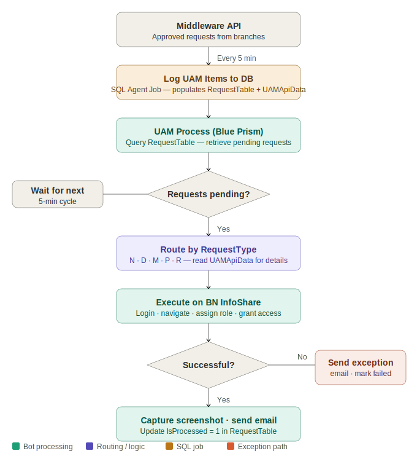

# 🔐 User Access Management Automation
### Blue Prism · Middleware API · BN InfoShare Portal · Real-Time Event Processing · SQL Server


---

## Overview

A Blue Prism automation that processes user access management requests in near-real-time — creating, modifying, disabling, and resetting access for users across enterprise systems. The bot polls for new requests every 5 minutes, processes each one against the **BN InfoShare** portal, captures screenshot evidence, and notifies stakeholders automatically.

Unlike batch or scheduled automations, this is an **event-driven architecture** — requests are processed within minutes of approval, end to end.

---

## Business Problem

| Pain Point | Impact |
|---|---|
| Manual retrieval and execution of each access request | High IT team time, onboarding delays |
| No automated evidence capture | Compliance risk — inconsistent audit trail |
| Inconsistent handling across request types | Error-prone when different staff treat requests differently |
| Manual stakeholder notification | Requestors unaware of access status |
| No retry or escalation on failures | Silent failures with no investigation path |

---

## Solution Results

| Metric | Result |
|---|---|
| Processing time per request | ~2 minutes end to end |
| Trigger frequency | Every 5 minutes — near real-time |
| Evidence capture | Screenshot attached to every confirmation email |
| Audit coverage | 100% — every request logged and status updated |
| Exception notification | Automated email on every failure condition |
| Manual IT effort eliminated | ~95% of provisioning steps |

---

## Architecture

```
┌─────────────────────────────────────────────────────────────────────┐
│                     Request Origin                                   │
│  Branch / End User  ──▶  Approval Workflow  ──▶  Middleware API     │
└─────────────────────────────┬───────────────────────────────────────┘
                              │ API call (every 5 min)
┌─────────────────────────────▼───────────────────────────────────────┐
│                  Log UAM Items to DB (SQL Agent Job)                 │
│  Populates:  RequestTable (to-do list)  +  UAMApiData (details)     │
└─────────────────────────────┬───────────────────────────────────────┘
                              │ Query (every 5 min)
┌─────────────────────────────▼───────────────────────────────────────┐
│                       UAM Process (Blue Prism)                       │
│  • Reads RequestTable for pending items                              │
│  • Reads UAMApiData for request details                              │
│  • Routes by RequestType (N / D / M / P / R)                        │
└─────────────────────────────┬───────────────────────────────────────┘
                              │
┌─────────────────────────────▼───────────────────────────────────────┐
│                  BN InfoShare Portal VBO                             │
│  • Authenticate  •  Navigate to Role Management                      │
│  • Execute access operation  •  Capture screenshot                   │
│  • Send confirmation email  •  Update request status                 │
└─────────────────────────────────────────────────────────────────────┘
```

---

## Process Flow



---

## Request Types Supported

| Code | Request Type | Description |
|---|---|---|
| `N` | New User | Create account and assign access on target portal |
| `D` | Disable / Delete | Remove access for departing or inactive user |
| `M` | Modify User | Update role, branch, or both |
| `P` | Password Reset | Reset user's system password |
| `R` | Timed Access | Grant access for specified hours (`-1` = indefinite) |

### Modify Sub-Types (ChangeType)

| Code | Change Type |
|---|---|
| `R` | Role change only |
| `B` | Branch change only |
| `BR` | Branch and role change |
| `I` | Branch posting limit increase |

---

## Key Components

| Component | Type | Purpose |
|---|---|---|
| `Log UAM Items to DB` | SQL Server Agent Job | Runs every 5 min — pulls from middleware API, populates RequestTable + UAMApiData |
| `UAM Process` | Blue Prism Process | Triggered every 5 min — reads requests, routes by type, calls portal VBO |
| `BN InfoShare VBO` | Visual Business Object | Authenticates to portal, performs access operation, captures screenshot |
| `RequestTable` | SQL Table | Bot's to-do list — one row per pending request, IsProcessed flag updated on completion |
| `UAMApiData` | SQL Table | Full request parameters — user details, role, branch, and 50+ portal-specific fields |

---

## Portal VBO — Execution Stages

| Stage | Type | Description |
|---|---|---|
| Initialise | Initialise | Sets up environment, loads credentials |
| Open Portal | Action | Navigates to BN InfoShare URL and authenticates |
| Wait | Wait | Waits for portal load confirmation |
| Navigate to Role Management | Action | Clicks Role Management tab via XPath selector |
| Enter User Email | Action | Inputs employee email into search/creation field |
| Role Assignment Choice | Choice | Routes to correct access logic based on role matrix |
| Select / Deselect Access | Action | Sets access checkboxes per role requirements |
| Grant Access | Action | Clicks Grant Access to apply the operation |
| Screenshot | Action | Captures portal screen as evidence of completion |
| Build Email Body | Multi-Calculation | Constructs confirmation email with request details |
| Send Confirmation Email | Action | Sends email with screenshot to stakeholders |
| Update Request Status | Action | Sets IsProcessed = 1 in RequestTable |
| Logout | Action | Closes portal session cleanly |
| Exception Handler | Block | Catches failures — sends error email, updates status |

---

## Exception Handling

| Exception | Cause | Bot Action |
|---|---|---|
| Incorrect input parameters | Invalid or missing API fields | Exception email · request marked failed |
| User already exists | Duplicate creation attempt | Exception email · investigation required |
| User does not exist | Cannot match user on portal | Exception email · verify user details |
| Role not found | Role not on portal or renamed | Exception email · verify role matrix |
| Branch not found | Branch not matched on portal | Exception email · verify branch list |
| Login failed | Credential issue or session timeout | Exception email · verify Credential Manager |
| Unable to load portal | Network or portal availability issue | Exception email · IT investigation |

> All exceptions are **isolated per request** — one failure does not prevent other pending requests from being processed.

---

## Database Design

### RequestTable — Bot To-Do List
Populated every 5 minutes by the SQL Agent job. One row per pending request. Bot queries this table on each trigger cycle.

Key columns: `ID`, `LogCodeBatch`, `RequestType`, `LogTime`, `IsProcessed`, `WhenToTreatRequest`, `ParamID`, `ApplicationName`

### UAMApiData — Full Request Parameters
Stores all 50+ fields required to perform any UAM operation. Linked to RequestTable via `ParamID`.

Key columns: `Email`, `Role`, `Branch`, `BranchCode`, `EmployeeID`, `UserID`, `RequestType`, `ChangeType`, `Is2FA`, `OldRole`, `OldBranch`

---

## Scheduling

| Component | Frequency | Purpose |
|---|---|---|
| Log UAM Items to DB | Every 5 minutes | Pull requests from middleware → database |
| UAM Process (Blue Prism) | Every 5 minutes | Process pending requests from database |

> End-to-end latency: **~10 minutes** from approval in middleware to access provisioned on portal.

---

## Security

- All credentials stored in **Blue Prism Credential Manager** — encrypted, never hardcoded
- Bot accessible only within internal network — no public exposure
- Role-based access control via Blue Prism role management
- Stage logging set to **errors only** — no personal data written to logs
- All user data **purged from bot memory** immediately after each request
- Screenshots archived on bot repository server — transmitted only to authorised stakeholders

---

## Documentation

📄 [Solution Design Document — SDD-BN-003](https://github.com/Zinniie/rpa-automation-portfolio/blob/main/06-user-access-management/docs/SDD-BN-003-User-Access-Management.pdf)

Covers: business context · AS-IS pain points · architecture · UAM process stages · portal VBO stage details · database schema · API parameter documentation · exception handling · scheduling · security · assumptions and dependencies

---

## Author

**Blessing Nnabugwu** — RPA Developer  
[LinkedIn](https://linkedin.com/in/blessingnnabugwu) · [Portfolio](https://zinniie.github.io/rpa-portfolio) · [GitHub](https://github.com/zinniie)
