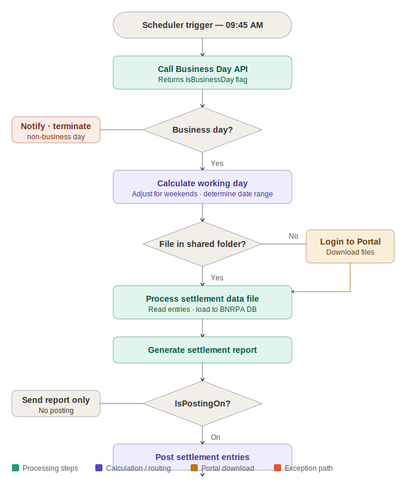

# 💳 Merchant Debit POS Settlement Automation
### Blue Prism · Business Day API · Settlement Portal · SQL Server · Posting Control


---

## Overview

A Blue Prism automation that handles the daily settlement of merchant debit POS transactions end to end — retrieving settlement data files, validating transactions against business day rules, posting credit and debit entries to the financial system, generating a formatted settlement report, and distributing results to stakeholders.

Two features make this bot architecturally distinctive:

**1. Dual file source strategy** — the bot checks the shared network folder first, and only logs into the Settlement Portal if the file is absent. This makes the process resilient to file deposit delays without manual intervention.

**2. Configurable posting control** — a database flag (`IsPostingOn`) allows posting to be enabled or disabled independently of the rest of the process. Settlement reports are still generated and distributed even when posting is off.

---

## Business Problem

| Pain Point | Impact |
|---|---|
| Manual file retrieval from portal or shared folder | Time-consuming, risk of wrong file version |
| Manual debit and credit posting | Error-prone during high-volume periods |
| No automated business day validation | Risk of processing on non-business days |
| No weekend aggregation logic | Non-business day files missed or double-processed |
| No posting control toggle | Cannot suspend posting without stopping the full process |
| Manual report distribution | Delays and inconsistent output format |

---

## Solution Results

| Metric | Result |
|---|---|
| Average run duration | ~2 minutes |
| Scheduled start | 09:45 AM daily (business days only) |
| File source resilience | Shared folder first → Portal fallback |
| Weekend handling | Automatic aggregation across non-business days |
| Posting control | Configurable flag — no code change required |
| Audit coverage | 100% — every run logged with count and volume |

---

## Architecture

```
┌─────────────────────────────────────────────────────────────────────┐
│              BN Operations Process (06:30 AM trigger)               │
│  Business Day API → Get Products → Route MDPS → Settlement VBO     │
└─────────────────────────────┬───────────────────────────────────────┘
                              │
┌─────────────────────────────▼───────────────────────────────────────┐
│              MDPS Business Object — 4 Pages                         │
│                                                                      │
│  ┌──────────────────────────────────────────────────────────────┐   │
│  │ Process Settlement (Main)                                    │   │
│  │ Date calc · Working day logic · Posting control · Output     │   │
│  └───────────────┬──────────────────────────────────────────────┘   │
│                  │                                                   │
│  ┌───────────────▼──────────────────────────────────────────────┐   │
│  │ Input Processing                                             │   │
│  │ File exists? → YES: process directly                         │   │
│  │               NO:  Login to Portal → Download → Process      │   │
│  └───────────────┬──────────────────────────────────────────────┘   │
│                  │                                                   │
│  ┌───────────────▼──────────────────────────────────────────────┐   │
│  │ Processing Settlement Data File                              │   │
│  │ Read file → extract entries → load to BNRPA DB              │   │
│  └───────────────┬──────────────────────────────────────────────┘   │
│                  │                                                   │
│  ┌───────────────▼──────────────────────────────────────────────┐   │
│  │ Generate Report → IsPostingOn? → Posting Item                │   │
│  │ Compile Excel report → Check flag → Post entries (if on)     │   │
│  └──────────────────────────────────────────────────────────────┘   │
└─────────────────────────────────────────────────────────────────────┘
```

---

## Process Flow



---

## Key Components

| Component | Type | Purpose |
|---|---|---|
| `Process Administrator` | Blue Prism Process | Triggered at 06:30 AM — calls BN Operations Process |
| `BN Operations Process` | Blue Prism Process | Business Day API · product routing · MDPS session management |
| `MDPS Business Object` | Visual Business Object | Four-page VBO — full settlement lifecycle |
| `Input Processing` | VBO Page | Dual-source file retrieval — shared folder or Settlement Portal |
| `Processing Settlement Data File` | VBO Page | Reads file, extracts entries, loads to BNRPA DB |
| `Generate Report` | VBO Page | Compiles Excel settlement report, sends stakeholder email |
| `Posting Item` | VBO Page | Posts credit/debit entries (only when IsPostingOn = True) |
| `BNProducts` | SQL Table | Master configuration — schedule, posting flags, file paths |
| `BNProductList` | SQL Table | Daily run tracker — count, volume, completion status |

---

## Posting Control Flag

The `IsPostingOn` flag provides operational control over the settlement posting step:

| IsPostingOn | Bot Behaviour |
|---|---|
| `True` | Full lifecycle — file retrieval + processing + report + **posting** |
| `False` | File retrieval + processing + report only — **posting skipped** |

To disable posting without stopping the settlement run:
```sql
UPDATE BNProducts
SET IsPostingOnForReconciliation = 0
WHERE ProductCode = 'MDPS'
```

---

## Working Day Logic

The bot includes automatic weekend and holiday date adjustment. When the settlement date falls after a weekend or public holiday, the bot:

1. Calculates the last valid working day
2. Determines how many days of files are required
3. Downloads all applicable files in a single portal session
4. Processes them as a combined settlement report for the period

---

## Dynamic File Path Structure

Settlement file paths are computed at runtime using a token-based naming convention:

| Token | Meaning | Example |
|---|---|---|
| `< >` | Settlement date | `<06 JAN 2025>` |
| `[ ]` | Transaction date | `[03 JAN 2025]` |
| `( )` | Transaction date + 1 | `(04 JAN 2025)` |
| `dd` | Day with leading zero | `06` |
| `MMM` | Abbreviated month | `Jan` |
| `yyyy` | Four-digit year | `2025` |

---

## Exception Handling

| Exception | Cause | Bot Action |
|---|---|---|
| Settlement file not found | Absent from shared folder and portal | Exception email · session terminated |
| Portal login failed | Credential issue or portal unavailable | Exception email · investigate Credential Manager |
| File download failure | Portal UI change or timeout | Exception email · IT investigation |
| Incomplete settlement file | File present but malformed | Exception email · re-obtain file |
| Business Day API failure | API unavailable | Session cannot proceed · IT notified |
| Posting failure | Financial system unavailable | Exception email · disable IsPostingOn and re-run |
| Retry count exceeded | Max attempts reached | Exception email · reset retry count in BNProductList |

---

## Scheduling

| Component | Schedule | Purpose |
|---|---|---|
| Load Products Job | 02:00 AM daily | Pre-populates BNProductList |
| Load Products File List Job | 02:00 AM daily | Pre-populates BNProductFileList |
| Process Administrator | 06:30 AM daily | Triggers BN Operations Process |
| MDPS Settlement Run | 09:45 AM daily | Merchant Debit POS Settlement session |

---

## Security

- All credentials in **Blue Prism Credential Manager** — encrypted, never hardcoded
- Bot accessible only within internal network — no public exposure
- Role-based access control via Blue Prism role management
- Stage logging set to **errors only** — no settlement data written to logs
- All in-memory data **purged at end of each run**
- Settlement results archived in BNRPA database for audit

---

## Documentation

📄 [Solution Design Document — SDD-BN-004](https://github.com/Zinniie/rpa-automation-portfolio/blob/main/07-merchant-debit-pos-settlement/docs/SDD-BN-004-Merchant-Debit-POS-Settlement.pdf)

Covers: business context · AS-IS pain points · dual file source architecture · posting control design · all VBO page stages · database schema · dynamic file path system · exception handling · failover procedures · configuration guide

---

## Author

**Blessing Nnabugwu** — RPA Developer  
[LinkedIn](https://linkedin.com/in/blessingnnabugwu) · [Portfolio](https://zinniie.github.io/rpa-portfolio) · [GitHub](https://github.com/zinniie)
