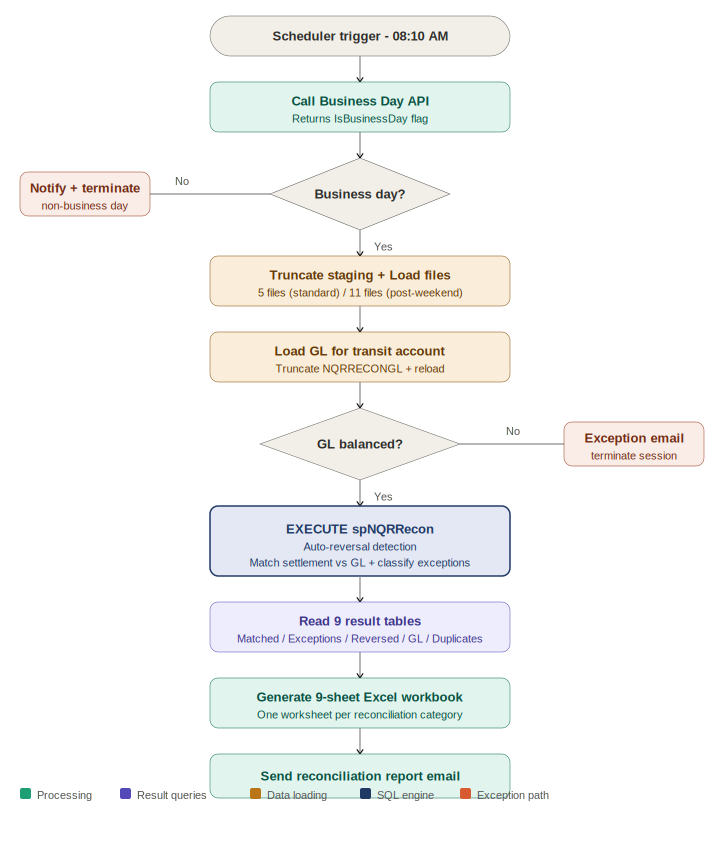

# 🔄 NQR Reconciliation Automation
### Blue Prism · SQL Reconciliation Engine · spNQRRecon · Business Day API · 9-Category Output


---

## Overview

A Blue Prism automation that performs daily reconciliation of NQR (National QR Code Payment) settlement records against General Ledger (GL) entries. The bot retrieves settlement report files, loads GL transit account data, executes a SQL stored procedure (`spNQRRecon`) that matches, classifies, and exceptions all transactions, then generates a 9-sheet Excel reconciliation workbook distributed to stakeholders.

**The defining architectural feature:** all reconciliation logic lives in the database. Rather than matching transactions in Blue Prism memory, the bot delegates the entire matching computation to `spNQRRecon` — a stored procedure that handles auto-reversal detection, dual-key matching, and exception classification entirely within the SQL engine. Blue Prism orchestrates the data flow; the database does the work.

---

## Business Problem

| Pain Point | Impact |
|---|---|
| Manual GL-vs-settlement comparison | 45-60 min daily, high error risk on large volumes |
| Inconsistent exception classification | Different analysts classify exceptions differently |
| No automated auto-reversal detection | Reversed entries appear incorrectly as exceptions |
| Manual multi-sheet report compilation | Time-consuming, formatting errors common |
| No structured audit trail | Cannot trace which entries matched on which date |
| Weekend aggregation handled inconsistently | Non-business day files missed or double-counted |

---

## Solution Results

| Metric | Result |
|---|---|
| Average run duration | ~10 minutes |
| Scheduled start | 08:10 AM daily (business days only) |
| Reconciliation engine | SQL stored procedure — consistent, auditable logic |
| Output categories | 9 — across matched, exceptions, reversals, GL balance, duplicates |
| Weekend handling | Automatic aggregation — 5 files standard, 11 files post-weekend |
| Audit coverage | 100% — full result set stored in BNRPA database per run |

---

## Architecture

```
┌─────────────────────────────────────────────────────────────────────┐
│         BN Operations Process (06:30 AM trigger)                    │
│  Business Day API → Get Products → Route NQRR → Recon VBO          │
└─────────────────────────────┬───────────────────────────────────────┘
                              │
┌─────────────────────────────▼───────────────────────────────────────┐
│         NQR Reconciliation Business Object — 5 Pages                │
│                                                                      │
│  Process NQR Recon (Main)                                           │
│  ├── Truncate NQRTransactionReport                                  │
│  ├── Move Files → Load 5/11 settlement files to staging table       │
│  ├── Get GL For Transit Account → Load NQRRECONGL                   │
│  ├── Validate Spooled GL → Check balance                            │
│  ├── EXECUTE spNQRRecon(@start_date, @end_date)                     │
│  │      ├── Detect auto-reversals → NQRRECONAutoReversed            │
│  │      ├── Match settlement vs GL credit → NQRReconMatched         │
│  │      └── Classify exceptions → NQRRECONGLException               │
│  ├── Read 9 result tables into BP collections                       │
│  ├── Generate Report → 9-sheet Excel workbook                       │
│  └── Send email with workbook attached                              │
└─────────────────────────────────────────────────────────────────────┘
```

---

## Process Flow



---

## Reconciliation Engine — spNQRRecon

The stored procedure performs reconciliation in 10 sequential steps:

| Step | Operation |
|---|---|
| 1 | Create temp tables for matched items, reversed pairs, and exceptions |
| 2 | Truncate `NQRReconMatched` and `NQRRECONGLException` from previous run |
| 3 | Load `NQRTransactionReport` to temp — strip quotes from `NIP_SESSION_ID`, strip `NQR/` prefix from `PAYMENT_REFERENCE` |
| 4 | Split `NQRRECONGL` into `#NQRRECONGLCREDIT` and `#NQRRECONGLDEBIT` by `PART_TRAN_TYPE` |
| 5 | **Auto-reversal detection** — match credits and debits on `TRAN_RMKS`; capture both sides; delete from temp tables |
| 6 | **Primary matching** — join settlement to GL credit on `NIP_SESSION_ID = TRAN_RMKS` OR `PAYMENT_REFERENCE = TRAN_RMKS` |
| 7 | Persist matched results to `NQRReconMatched` |
| 8 | Classify remaining GL entries: credits → `Cr Exception`, debits → `Dr Exception` |
| 9 | Persist auto-reversals to `NQRRECONAutoReversed` |
| 10 | Return remaining settlement entries as settlement exceptions |

### Matching Logic
```sql
-- Dual-key matching join
FROM #nqrtransactionreport a
INNER JOIN #NQRRECONGLCREDIT b
    ON a.NIP_SESSION_ID    = b.TRAN_RMKS   -- Key 1: Session ID match
    OR a.PAYMENT_REFERENCE = b.TRAN_RMKS   -- Key 2: Payment reference match
```

---

## 9 Reconciliation Output Categories

| Category | Source Table | Description |
|---|---|---|
| **Proof** | Computed | Settlement vs GL balance summary |
| **Matched** | `NQRReconMatched` | Successfully matched settlement-to-GL pairs |
| **Exceptions** | spNQRRecon return | Settlement entries with no GL match |
| **GL Balance** | `NQRRECONGL` | Full GL transit account entries |
| **Settlement Summary** | `NQRTransactionReport` | Summary across all settlement sessions |
| **Settlement Report** | `NQRTransactionReport` | Full settlement report entries |
| **Auto Reversed** | `NQRRECONAutoReversed` | GL credit/debit pairs with same TRAN_RMKS |
| **GL Exceptions** | `NQRRECONGLException` | Unmatched GL entries (Cr + Dr) |
| **Duplicates** | `NQRRECONGL` | Duplicate GL entries detected |

---

## Key Database Tables

| Table | Type | Purpose |
|---|---|---|
| `NQRTransactionReport` | Staging | Settlement report entries — truncated and reloaded each run |
| `NQRRECONGL` | Staging | GL transit account entries — truncated and reloaded each run |
| `NQRReconMatched` | Result | Matched settlement-to-GL pairs |
| `NQRRECONGLException` | Result | Unmatched GL entries (Cr Exception / Dr Exception) |
| `NQRRECONAutoReversed` | Result | Auto-reversed GL entry pairs |

---

## Weekend / Holiday Logic

NQR Reconciliation runs on business days only — **excluding the business day immediately following a non-working day.** Non-business day files are aggregated:

- **Standard business day:** 5 settlement report files
- **Post-weekend / post-holiday:** 11 settlement report files (covering all non-business day sessions)

The GL dataset spans the full non-business day period — the stored procedure date range parameters handle this automatically.

---

## SQL Files

| File | Contents |
|---|---|
| [`nqr-recon-schema.sql`](./sql/nqr-recon-schema.sql) | All staging and result table DDL — `NQRTransactionReport`, `NQRRECONGL`, `NQRReconMatched`, `NQRRECONGLException`, `NQRRECONAutoReversed` |
| [`sp-nqr-recon.sql`](./sql/sp-nqr-recon.sql) | Full `spNQRRecon` stored procedure — all 10 reconciliation steps with inline documentation |

---

## Exception Handling

| Exception | Cause | Bot Action |
|---|---|---|
| Settlement file not found | Required files absent from shared folder | Exception email · verify upstream sessions completed |
| GL not balanced | Spooled GL failed validation check | Exception email · investigate GL extract |
| spNQRRecon failure | SQL error during stored procedure execution | Exception email · review Control Room logs |
| Business Day API failure | API unavailable | Session cannot proceed · IT notified |
| Wrong file count | Fewer than 5/11 files in shared folder | Exception email · verify all sessions completed |
| Retry count exceeded | Max attempts reached | Exception email · reset NoOfRetries in BNProductList |

---

## Scheduling

| Component | Schedule | Purpose |
|---|---|---|
| Load Products Job | 02:00 AM daily | Pre-populates BNProductList |
| Load Products File List Job | 02:00 AM daily | Pre-populates BNProductFileList |
| Process Administrator | 06:30 AM daily | Triggers BN Operations Process |
| NQRR Reconciliation Run | 08:10 AM daily | NQR Reconciliation session |

---

## Security

- All credentials in **Blue Prism Credential Manager** — encrypted, never hardcoded
- Bot accessible only within internal network — no public exposure
- Stage logging set to **errors only** — no transaction data written to logs
- All in-memory data **purged at end of each run**
- Full reconciliation results stored in BNRPA database for audit

---

## Documentation

📄 [Solution Design Document — SDD-BN-005](./docs/)

Covers: business context · AS-IS pain points · database-centric architecture · stored procedure design · all VBO page stages · 9 output categories · GL staging logic · weekend aggregation · exception handling · failover procedures

---

## Author

**Blessing Nnabugwu** — RPA Developer  
[LinkedIn](https://linkedin.com/in/blessingnnabugwu) · [Portfolio](https://zinniie.github.io/rpa-portfolio) · [GitHub](https://github.com/zinniie)
